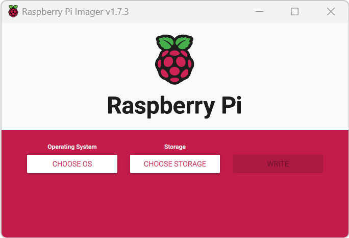
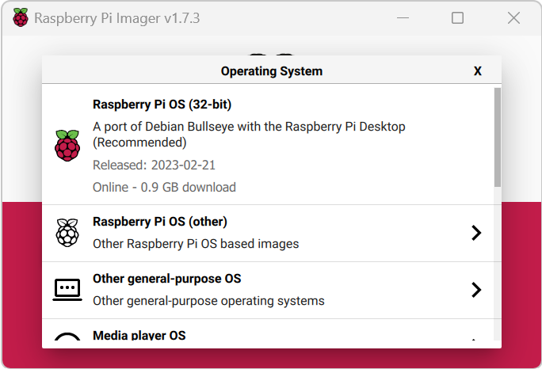
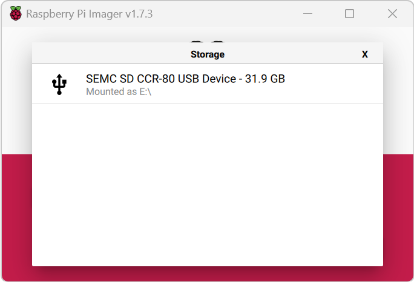
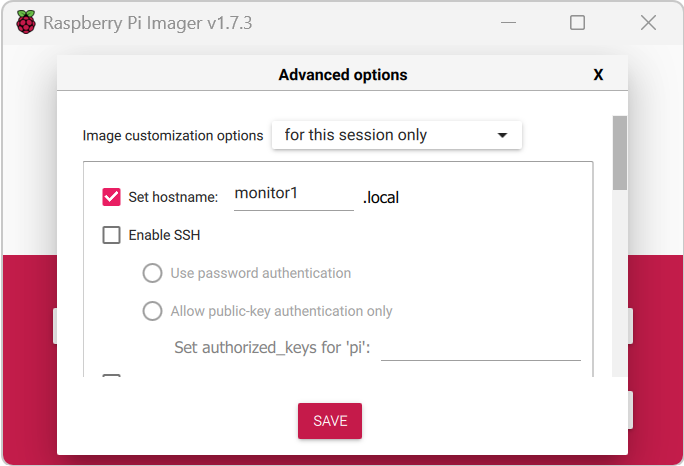
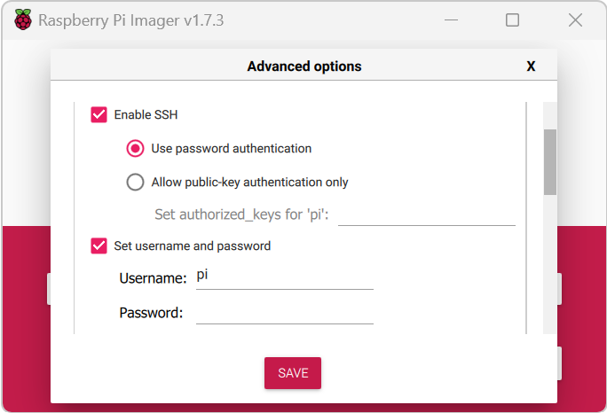

# Environmental Monitoring

Coursework for the *Physics Group Project* university module.

The project aims to create an environmental monitoring system using a Raspberry Pi 3B with the Enviro+ Monitor. 

## Project Contributors
- Core team:
	- Chenxi Feng
	- Maya Jagpal
	- Juliette Keller
	- Ruiming Liu
	- Daniel Maguire
	- Aditya Marathe
	- Maj Mis
	- Emi Shindate
	- Celia Yuan

- Project supervisor:
	- Paul Bartlett

## Setup Guide
> **Note:** You may also use the preset Rasberry Pi Image avalible on our repository to skip setup. However, please note that *the image may not be up-to-date*.

1. To start, we want to flash an image of the Raspbian operating system (OS) on an micro SD card. The simplest way to achieve this is by  installing the Raspberry Pi Imager from their official website's [downloads page](https://www.raspberrypi.com/software/).
> **Note:** Balena Etcher is another popular alternative, but for this you will have to manually install the most up-to-date image of Raspbian from the downloads page (link provided above). This tutorial will only be covering how to use Raspberry PI imager.
2. After installation, "allow the app to make changes to your device" and you should see the following window on your screen.

3. Click on "Choose OS" and select "Raspberry Pi OS (32-bit)". This installs the latest version of Raspbian (or Debian, a Linux-based OS).

4. Using an micro SD card reader, connect your micro SD card to your computer - you should see a notification from your computer if a storage device was connected. Remember the location (or direcotry) of the micro SD card e.g., "E" or "D" drive.
5. Next, click "Choose Storage" and select the directory of your micro SD card. 

6. Click the settings icon which has now appeared in the bottom right hand corner. You may set your own hostname, but for this tutorial we will use the hostname "monitor1.local".

> **Note:** The next 2 steps
7. Check the "Enable SSH" option and select "Use password authentication" which uses the device's password to authenticate an SSH connection. SSH or Secure Shell, is a protocol which allows us to securely connect to our Raspberry Pi via a network connection.

8.  
